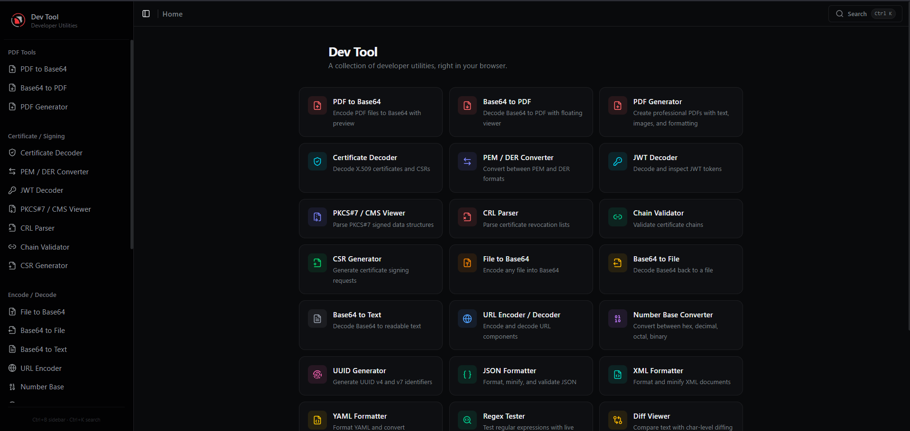

# Dev Tool

Modern, browser-based developer toolkit for encoding, decoding, formatting, certificate inspection, and utility workflows.

[Live Demo](https://pyojan.github.io/base64-encode-decode/)



## What Is New

This project has been expanded from a simple converter into a multi-tool web app with 25+ utilities:

- PDF workflows
- Base64 and file conversion
- Certificate and signing analysis
- JSON/XML/YAML formatting
- Text and data tools
- Common developer utilities

## Core Highlights

- Client-side processing for most operations
- Multi-tool navigation with quick command palette
- Mobile-friendly UI
- Copy-friendly outputs for fast developer workflow
- GitHub Pages ready build and deployment setup

## Tool Catalog

### PDF Tools

- PDF to Base64
- Base64 to PDF
- PDF Generator

### Certificate and Signing

- Certificate Decoder (X.509/CSR)
- PEM/DER Converter
- JWT Decoder
- PKCS#7/CMS Viewer
- CRL Parser
- Chain Validator
- CSR Generator

### Encode / Decode

- File to Base64
- Base64 to File
- Base64 to Text
- URL Encoder/Decoder
- Number Base Converter (hex/dec/bin/oct)
- UUID Generator (v4, v7)

### Formatters

- JSON Formatter
- XML Formatter
- YAML Formatter

### Text / Data

- Regex Tester
- Diff Viewer
- CSV/JSON Converter
- Color Converter (HEX, RGB, HSL, HSV)

### Utilities

- Hash Generator
- Timestamp Converter

## Tech Stack

- React 19
- TypeScript
- Vite 6
- TanStack Router
- Tailwind CSS 4
- Radix UI + custom UI components

## Getting Started

### Prerequisites

- Node.js 18+ (Node.js 20 LTS recommended)
- npm

### Install

```bash
git clone https://github.com/PYOJAN/base64-encode-decode.git
cd base64-encode-decode
npm install
```

### Run Locally

```bash
npm run dev
```

### Production Build

```bash
npm run build
```

### Preview Build

```bash
npm run preview
```

## NPM Scripts

- `npm run dev` - Start development server
- `npm run build` - Type-check and create production bundle
- `npm run preview` - Preview production build locally

## Project Structure

```text
base64-encode-decode/
|- public/                 # static assets, icons, screenshot, PWA files
|- src/
|  |- components/          # UI and reusable components
|  |- hooks/               # reusable React hooks
|  |- lib/                 # editor themes and helpers
|  |- routes/              # tool pages (TanStack file-based routes)
|  |- utils/               # conversion/parsing/crypto helpers
|  |- main.tsx
|- index.html
|- vite.config.ts
|- package.json
```

## Deploy New Updates to GitHub Pages

Repository: `https://github.com/PYOJAN/base64-encode-decode`

This project is configured for Pages with:

- Vite base path: `/base64-encode-decode/`
- Pages branch: `gh-pages`
- Site URL: `https://pyojan.github.io/base64-encode-decode/`

### One-Time Setup (if needed)

Install deploy package:

```bash
npm install --save-dev gh-pages
```

Optional scripts in `package.json`:

```json
{
  "scripts": {
    "predeploy": "npm run build",
    "deploy": "gh-pages -d dist"
  }
}
```

### Publish a New Update

```bash
git add .
git commit -m "update: describe changes"
git push origin master
npm run build
npx gh-pages -d dist
```

If `deploy` script is added:

```bash
npm run deploy
```

### GitHub Pages Settings Check

In GitHub:

1. Open `Settings -> Pages`
2. Source: `Deploy from a branch`
3. Branch: `gh-pages`, folder: `/ (root)`
4. Save

## Troubleshooting

### PowerShell blocks `npm`

If you see script execution policy errors for `npm.ps1`, run:

```powershell
npm.cmd run build
```

or adjust PowerShell execution policy for your machine/user.

### Blank page after deployment

- Confirm `vite.config.ts` has `base: "/base64-encode-decode/"`
- Rebuild and redeploy `dist`
- Wait a minute for Pages cache refresh

### Route 404 on refresh

GitHub Pages is static hosting. Keep `public/404.html` in the project so SPA routes can recover.

## License

MIT
